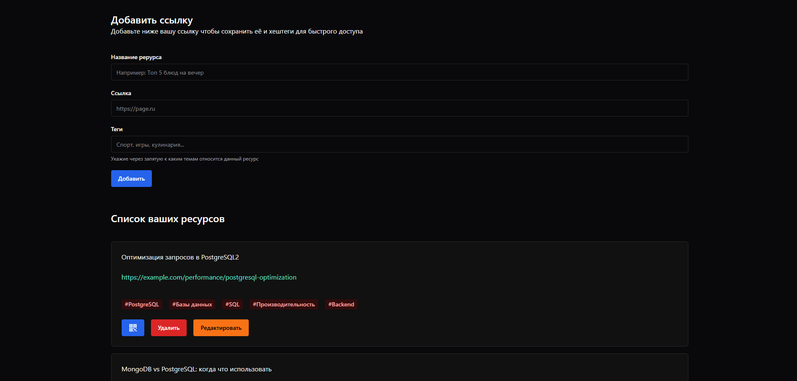

# ReadLater



Данное приложение нужно для архивации ваших ресурсов. Вы можете добавить заголовок, ссылку и теги для быстрого поиска ресурса. Также вы можете делать QR-code для своих целей(быстрого показа ссылки или вставки на другие ресурсы).
Приложение является PWA, это значит что вы можете его установить и не использовать только в браузере

## Стек технологий
React, TypeScript, Zustand, React-Router-DOM, React-Hook-Form, Chakra UI, Yup

## Запуск проекта

Запуск
```bash
npm install
npm run dev
```

## Версии

### 0.0.1 - Первая версия
В данной версии работают все функции которые написаны в начале файла. Есть нестабильность на мобильных устройствах, но в будущих обновлениях будут выходить фиксы для предотвращения данной проблемы
